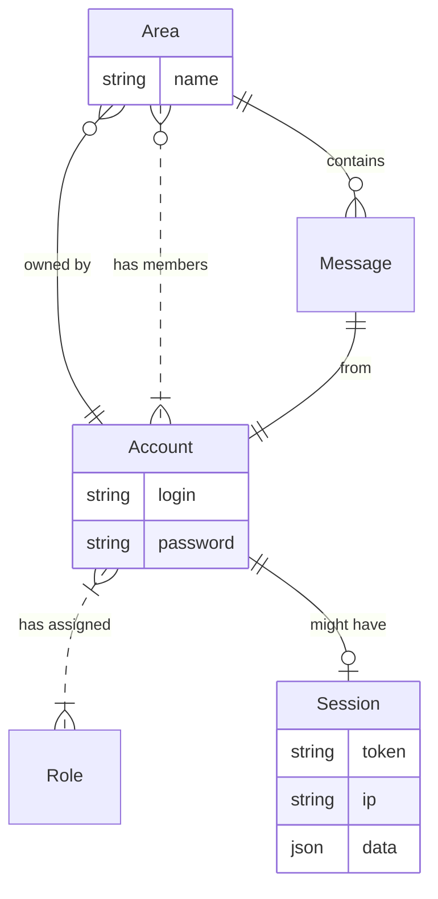
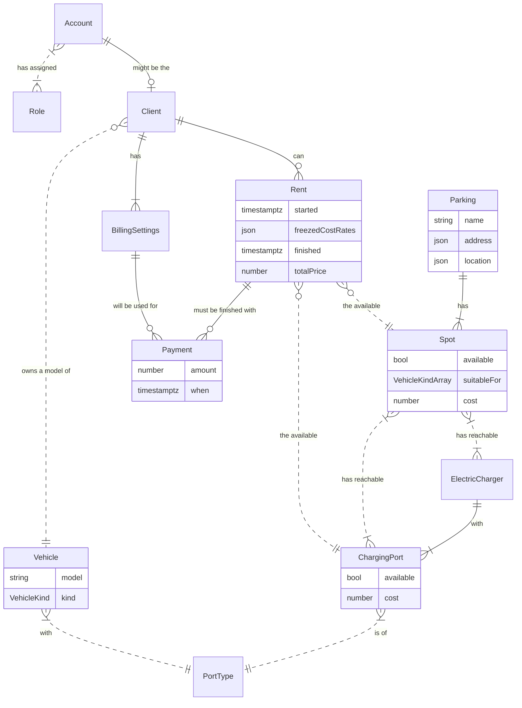

# NodeJS Application domain layer with models defined in Prisma format
Part of educational project in [Metatech University](https://github.com/metatech-university/)'s NodeJS 2022-23 course. This repository contains code of the application domain layer: configs, static frontend files, models/schemas, API methods, business logic services etc. The repository represents application variant where domain models are defined in [Prisma](https://www.prisma.io/) format. The application can be launched by system layer from different repository (it expected to be placed as sibling folder or one of the parent level).

The available system layer repositories:
- [metatech-university-NodeJS2023-SystemLayer-Pure](https://github.com/KLarpen/metatech-university-NodeJS2023-SystemLayer-Pure).

The code is considered as the next step of progressive development of the project `d-tasks2-messenger` from [metatech-university-NodeJS2022-homework](https://github.com/KLarpen/metatech-university-NodeJS2022-homework/tree/prisma/JavaScript/d-tasks2-messenger) repository. Specifically as result of splitting layers into separate repositories: system and application itself. The goal behind the splitting decision is to explicitly build framework agnostic application structure that might be launched with different system layer runners (i.e. application servers) which itself might be based on different frameworks, libraries etc.

## Application domains

### Common domain for all educational course participants: messenger chat

### Selected custom domain: EV Parking
Parking network for electric vehicles with warranty of available electric charger on the spot.

If the diagram not renders you may watch it on the [Mermaid.live](https://mermaid.live/edit#pako:eNp9VMuOGjEQ_BXLZxaFRNqs5rYhm0sUCUGUQ8SlGTeMN34g2xMCM_x72h7DmkciDiPbVdXdVcYdr61AXnF0nyVsHOilYey5rm1rAjv243HfsblVyCq25A14Bt7LjUGx5CWy7x8ebM-mSiKtIlbLTRPYCllocMDmwwgl0U9SKWk2CwyBPp44pF7AjpZq9-wHNrLO5e3OUH2mqWPF7HpQPQFSrz2bWRe-77eRsJOhWZqImReCi60dGqS-GPwGqWClcoclbtqA21BnUfBf-GIi2w3sitWQal7Pl0Ez2OuTRTuCRIdaj4KtrSuauIPWrU9-rqWRviFGmo8PE87A_aIyJ3PzkNnRtMpZviisg5N1Gg_dOVaHUDdvk5WUGyfu4K9lcx9X1CERdrl9G9ySS5_zLRPu4oIxT3Vo0nQLhp0M-CqNYOSCiLvH0pVLpgGNw8art4aBEA69L3aUrSFIa846yY0ssrJWFffguoFn52DPfCtDPP5CoSaEafWKbKmtD2fVCxf-o36Pmy5J5gSp0QfQ23CgEcEFFMUwa4d4QDEl9hwC-lvO6UJdVAs2gJpRoli4OVzG7gIIOj4At6q7BgcD-YhrdBqkoGcmcdN_iTLgMWpBGcWkIw7aYBd7U_MquBZHvN0Kajk_TLxag_K0uwXDq47_4dXk6f346ePj5MPj6Tfie169O474wVpiTEYchQzWfRteufTYJYWf6TyWOf4Fl8uyag)

### Domain model schemas

All domain models described in `prisma/schema.prisma` file.

### JSON Schema for validation

There is `/schemas/validation-schema.json` file. That's manualy enhanced version of auto generated `/prisma/json-schema/json-schema.json` by Prisma. It better to keep it separate due to specifics of auto generated schema and unability to declare some validation restrictions in `schema.prisma` itself.
